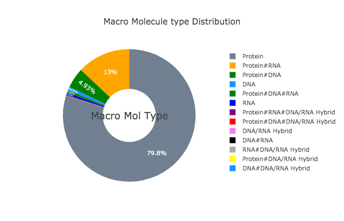
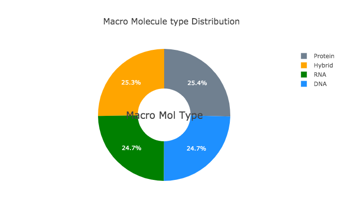
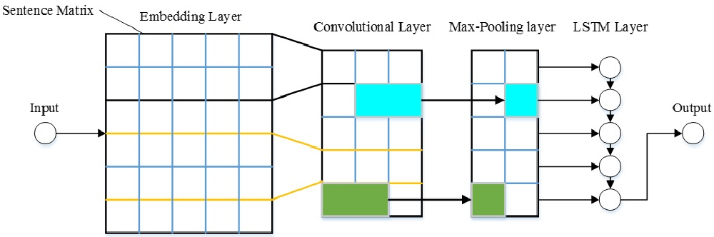
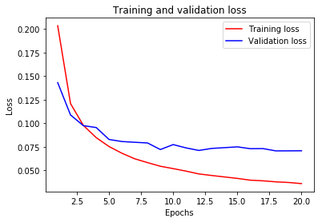
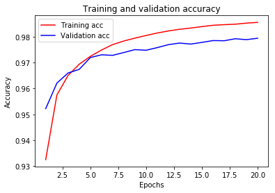
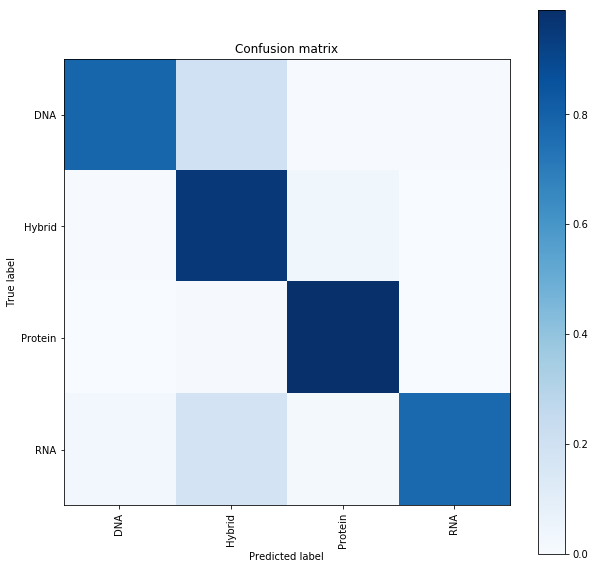
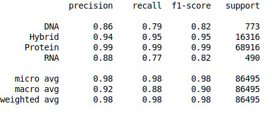

# Macromolecule classification
## Introduction
In this study we focused on classification of protein sequences with deep learning techniques. The study of amino acid sequence is vital in life sciences.  We used different word embedding techniques from Natural Language processing to represent the amino acid   sequence   as   vectors. Our main goal was to classify sequences to four group of classes, that are DNA, RNA, Protein and hybrid. After several tests we have achieved almost 99% of train and test accuracy. We have experimented on CNN, LSTM, Bidirectional LSTM, and GRU. 
 
## Dataset
Initially the dataset had 10 classes and wasnt normalized. Most of the data was from protein class as shown in figure below. 

 
## preprocessing
In our preprocessing step we have reduced the number of classes to four. We called all the hybrid protein macromolecules as only hybrid, regardless of what kind of hybrid structure it is, and the protein labelled as protein only. The figure 3. Gives us detail of our new data.

## Model
Different models were developed and tested. One of the model architecture and its results are shown here. 

## Model Loss and Accuracy

 

## Model Results:

  
   

## Overall Results
 
Experiments on four differnt model were carried out. Table below shows accuracy comparison of all the models described below. CNN model has so far achieved the best and highest accuracy and precession. In terms of recall the CNN-GRU overperform CNN model.
 
<table style="width:100%">
  <tr>
    <th>Model</th>
    <th>Accuracy</th> 
    <th>Precision</th>
      <th>Recall</th>
    <th>F1-score</th>
      	
  </tr>
  <tr>
    <td>CNN</td>
    <td>0.98</td> 
    <td>0.91</td>
  <td>0.875</td>
  <td>0.895</td>
  </tr>
  <tr>
    <td>Bi-LSTM</td>
    <td>0.77</td> 
    <td>0.77</td>
  <td>0.78</td>
  <td>0.76</td>
  </tr>
  <tr>
    <td>CNN-LSTM</td>
    <td>0.79</td> 
    <td>0.78</td>
  <td>0.79</td>
  <td>0.78</td>
  </tr>
  <tr>
    <td>CNN-GRU	</td>
    <td>0.90</td> 
    <td>0.90</td>
  <td>0.92</td>
  <td>0.92</td>
  </tr>
  
</table>
		

